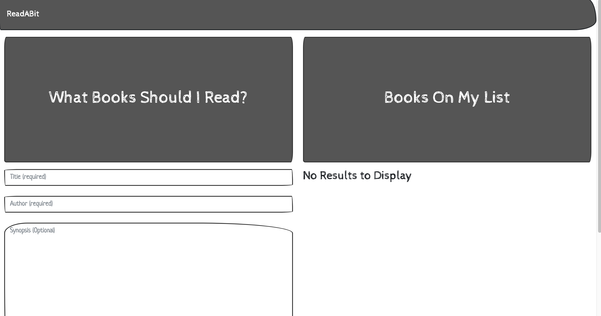

# ReadABit
 ### Goals and Challenges
 - Create fullstack app (backend is provided, but use your own `URI string`)
 - Convert class based app to hooks (on new branch. Ex: `hooks-solution`, keep class solution on `main` branch)
 - Add redux (on new branch. Ex: `redux-solution`)

# STEP 1
> Set Up & Get Books

In this step we will add functionality to a full stack React application for retrieving books from a database.

## Instructions

* Clone this Initial [Repo](https://github.com/urakymzhan/ReadABit-starter-code) in your editor and run `npm install` at the project's root.

* This application uses a Mongo database, so be sure to have a `mongodb atlas collection` ready.

* I would prefer Atlas, but if you decide to run database locally. Follow this [guidlines](https://gist.github.com/urakymzhan/8a74099d41d203e175c4bfb0ed57509f)

* Create `.env` file at the root and put your mongodb uri. Ex: `mongodb+srv://<user>:<password>@books.cuyyq.mongodb.net/<dbName>?retryWrites=true&w=majority`

* In order to initially populate the database, run the following command at the project root: `npm run seed`.

* This should insert a few records into the MongoDB.

* Run `npm start` at the project root to start the application.

* If you having errors: try deleting **node_modules** from both client and server. Then rerun `npm install` and `npm start`.

* Open your browser to [localhost:3000](http://localhost:3000) and take a moment to study the rendered application.

  * This example is a readabit application. Currently the app **isn't** fully functional.

* Open up `client/src/pages/Books.js` and add code so that when the component mounts, it performs an AJAX request to retrieve all of the books in the database. Once the AJAX request is complete, it should set `this.state.books` equal to the array of books.

* If successful, a list of books should be rendered on the right side of the page.

## Hints

* Use the API helper module (`client/src/utils/API.js`) to perform an AJAX request which should return _all_ of the books in the database.

* The only file you will need to modify is `client/src/pages/Books.js`.

# STEP 2
> Form Handling: Delete, Save, Update Books

In this step we will add functionality to the [STEP 1](#step-1) example for submitting and deleting books from the database.

### A

* Open the `Books.js` file. Add code so that `this.state.title`, `this.state.author`, and `this.state.summary` are updated as their corresponding `Input` components are updated (see the `name` properties on each `Input`). Any props you attach to the `Input` components will be passed down to their underlying elements, so there's no need to modify any code other than the code inside of `Books.js`.

* Add code so that when the `FormBtn` is clicked, an AJAX request is performed saving the new book. An object containing the new book's `title`, `author` and `summary` should be passed into the `API.saveBook` method.

### B
* Add code to the `Books.js` file so that when the `DeleteBtn` (`✗` button) component is clicked, its book is deleted from the database and the books displayed are updated. To accomplish this you should create a new method (`deleteBook`) on the `Books` component, which calls the `API.deleteBook` method when the `DeleteBtn` is clicked.

#### Hints

* The only file you need to modify is `Books.js`.

* See [React's Documentation on Handling Events](https://facebook.github.io/react/docs/handling-events.html)

# STEP 3
> React router: Book Page Details

In this step we will add React Router to the Books application in order to render a book details page as well as a no match 404 page.

### A

* Set up React Router inside of the `client/src/App.js` file.

  * The `/` and `/books` routes should both render the `Books` component page.

### B

* Notice that inside of the `pages` folder we have a `NoMatch` component. This is the component for our 404 page.

* Add a route for the new `NoMatch` component. This should only render if no other routes are matched. e.g. `/sjdfhjsdhfjsa` or `/notarealroute/lalala` should both render the `NoMatch` component page. 

  * You will need to use the `Switch` component from the React Router Dom library to accomplish this. An example can be found [here](https://reacttraining.com/react-router/web/example/no-match).

### C

* Notice that in the `pages` folder we have a `Detail` component. This component displays additional information about a book.

* Add a route for the the new `Detail` component. This should render when the `/books/:id` path is matched. e.g. if a book's `_id` is `59a39cf2549cf482c814333f`, then `/books/59a39cf2549cf482c814333f` should render its book `Detail` page.

* Inside of the `Detail` component, add code so that when the component mounts, we retrieve the book for the rendered route and save it to `this.state.book`. e.g. when the route is `/books/59a39cf2549cf482c814333f`, an AJAX request should be made to get the book with an `_id` of `59a39cf2549cf482c814333f`. If completed successfully, you should see the book's summary on this page.

  * You may need to look into [URL params with React Router](https://reacttraining.com/react-router/web/example/url-params) to accomplish this.

  * To access props in a class component you must use `this.props` instead of `props`.

### Hints

* A - B will only require you modify the `client/src/App.js` file.

* The React Router DOM library should already be installed. Looks inside `client/package.json`

* The React Router documentation is your friend!

* Ask the instructor/TA if you're having difficulty understanding any of the activity requirements.

# STEP 4
### Stretch Challenge

> Converting to hooks 

- Can you convert this project to use React Hooks?

### Hints
- Create a new branch called `hooks-solution` from main.

- The only file you need to modify is `Books.js`.

- Documentation of [React Hooks](https://reactjs.org/docs/hooks-intro.html)

# STEP 5
### Stretch Challenge

> Redux solution. Integrate redux.

### Hints
- Create a new branch called `redux-solution` from main.

- Inside `client/src` create a new folder called **redux**

- Keep all redux logic inside this folder. Write your actions/reducers/store/middlewares.

- You still need to be able to perform operations inside `API.js` file.

- Don't forget to get **details** of each books inside Details page.

- The only file you need to modify is `Books.js`.

- Documentation of [Redux](https://redux.js.org/tutorials/fundamentals/part-2-concepts-data-flow)